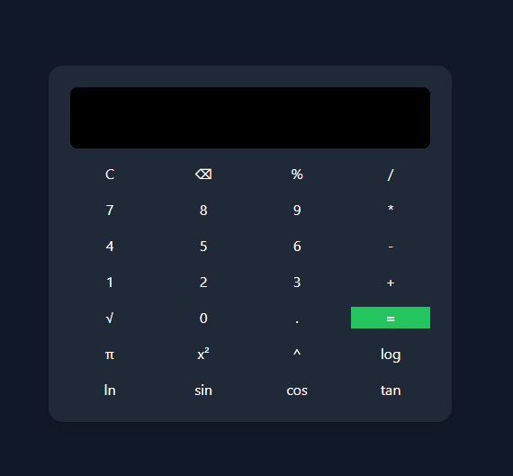

# 🧮 Calculadora Científica

Una calculadora científica web creada con **HTML**, **TailwindCSS** y **JavaScript**, que incluye:

✅ Operaciones básicas: suma, resta, multiplicación, división  
✅ Porcentaje, raíz cuadrada, π  
✅ Funciones científicas: potencias, logaritmos, trigonometría  
✅ Interfaz responsiva y moderna con TailwindCSS  

---

## 🛠️ Tecnologías utilizadas

- HTML5
- CSS3 (con TailwindCSS)
- JavaScript (ES6)
- Git & GitHub

---

## 📸 Vista previa



---

## 🚀 Cómo usar

1. Clona este repositorio:
```bash
git clone https://github.com/JoseMoreno7/calculadora-js.git
